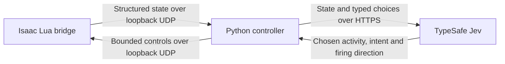

# Architecture and current limits

## State and decisions

Jev receives structured state, not screenshots. Observations include player
position and velocity, health and resources, item metadata where available,
enemies, projectiles, grid collisions, supported ground effects, pickups, doors,
pressure plates and observed floor connections. The controller adds relative
combat geometry, visited-room memory, recent outcomes and remaining budgets.
Missing information is not meant to imply an empty or safe room.

Floor memory explicitly tracks item rooms as not observed, found but unvisited,
or visited. Observed locked entrances count as found, without becoming traversable
edges. Large-room aliases are kept together; multiple item rooms remain separate.
The accompanying rules explain their value as sources of run-long upgrades and
their usual key cost, without forcing an exploration order or claiming every
floor contains one. Visiting a room does not prove its item was taken.

Pickups left in directly observed rooms are remembered by room, type/subtype,
count and shop price; heart types have readable labels. These are last-seen
facts, not live offscreen observations. A complete new room observation replaces
its snapshot, removing collected/disappeared supplies and empty pedestals.
Missing pickup data or an imported visited-room summary cannot erase or invent
supplies. Both memories survive authenticated same-floor rearming and reset for
a new floor/run. They do not create routes, collection or spending authority.

`player_policy.py` builds typed choices for combat and room activities.
`player_navigation.py` executes selected activities through the movement and
interaction helpers. `controller.py` coordinates fresh observations, asynchronous
model replies, pauses, budgets and reports. `mod/jev_bridge/main.lua` exports the
state and applies bounded controls after F8 activation.

Combat intent and firing direction are independent questions in one request.
Neither question can assume it knows the other's answer. Aim hints describe the
current position; potential future firing positions are labeled separately.
Jev is told that movement momentum can bend tears across the firing axis.
Actual tear-velocity inheritance has not been calibrated.

Combat firing also receives a compact `firing_now` view for each button: enemies
on that side, enemies aligned with the current straight firing lane, and aligned
enemies without observed solid-grid blockers. It summarizes current geometry,
does not rank directions, and does not use previous inputs or future waypoints.
Incomplete grid clearance is unknown, not an empty list of obstacles. These
ordinary-tear estimates do not guarantee hits with momentum, range limits,
moving enemies or special weapons. Previous controls are explicitly history.
Bounded decision reports retain the validated firing probability distribution
and current geometry at both request and reply time. This separates repeated
model choices from changes during response latency; it does not override aim.

The local loop runs much more frequently than model decisions. Immediate dodges
can override movement and are logged. Local execution preserves the selected
cardinal firing button. A blocked selected activity returns to Jev rather than
automatically choosing a different room or pickup.

Open-door candidates include the destination's last complete pickup snapshot,
including an explicit `none_observed` status. Imported visits without a pickup
observation remain `unknown`; a remaining or swapped item stays `present`.
Item-room summaries expose the same distinction. Candidate descriptions and
choice criteria include these facts, so treasure-room type does not stand in for
an unclaimed reward. Remembered permitted exits can show a room whose only known
route returns to the current room, without claiming there are no hidden exits.
The model also receives up to twelve confirmed room crossings from its bounded
activity history and per-door completed-entry counts. These are observations,
not revisit bans or a preferred route; every otherwise supported door remains
selectable. Same-floor recovery retains memory; a new floor starts fresh.

Cleared rooms also offer general `move_to` positions and an independent `fire`
question in the same request as activity selection. Jev can move and fire, or hold
the activity and fire, simultaneously. Repositioning does not collect pickups or
cross doors. During an ongoing activity, fire-only requests refresh aim without
restarting the selected route. Equal consecutive directions can keep a button
held; `none` releases it. The same freshness, request-rate and budget limits apply.
Selected prop shooting and TNT/bomb routines own firing while they execute, so
independent firing cannot disrupt their aimed shots or committed retreat.

Firing uses the observed current weapon, including Technology, without promising
a hit or assuming ordinary-tear physics. Weapon changes invalidate a previous
firing choice. Charge/release mechanics and synergies are not fully modeled.
Object-specific actions remain useful shortcuts, but their narrower weapon
support no longer removes all firing choices in cleared rooms.

The HTTP connection is refreshed before a new request after more than five
seconds idle, including pauses and floor transitions. Failed requests are never
replayed. With `--stay-ready`, connection failures/timeouts release control and
keep the listener and in-memory key open for a fresh same-run/floor F8 session.
The next decision uses fresh state; waiting and recovery retain the original
deadline and request cap. This does not automatically retry HTTP billing/auth
errors or unrelated programming failures.

In player mode, observed ordinary and tinted rocks can also be offered as
standalone `bomb_rock` activities in cleared rooms. A visible reward behind the
rock is no longer required. Jev receives the bomb cost and general purpose;
unexposed drops remain unknown. The executor checks ordinary-bomb inventory,
the exact rock, a placement route and a straight retreat, then places one bomb
and waits outside its range for observed destruction. New drops or openings
require another Jev decision. The existing bomb-to-pickup plan remains available.
Walls, pits, special rocks, modified bombs and explosive chains are outside this
bounded planner; absent offers do not imply the game mechanic is impossible.

After combat, a stationary ordinary/red fire can leave Isaac within its extra
navigation buffer. A bounded outward step may leave that buffer while retaining
the player radius plus two units around the observed fire body. Normal routes
retain the larger buffer; contact overlap, inward momentum, unobserved/special
fire behavior and all other obstacle exclusions still block this recovery.

The bridge distinguishes a confirmed item-use animation from an ordinary pause.
Isaac's [`Game:IsPaused()`](https://wofsauge.github.io/IsaacDocs/rep/Game.html#ispaused)
also covers full-screen item animations. A matching item/card/pill use callback
after an emitted Jev input permits one animation in the same room, beginning
within two simulation ticks and 0.55 seconds, and ending within three seconds of
use. Movement and firing are released throughout. Resume requires observations
from after the frozen frame; old commands and item pulses cannot replay. The
controller keeps the same attempt and budgets. Escape, P, controller pause, F8,
death, unexpected room changes and the deadline still revoke control. A use
callback alone cannot authorize a pause without the corresponding Jev pulse.
`last_item_use` and `item_animation` provide observed diagnostics. Teleporting or
unusually long item effects may still require manual rearming.

Geometry supports 512 total hazards, with a separate 160-entity hazard cap and
the existing 60,000-byte datagram limit. Large-room grids no longer share the old
160-cell cutoff. Geometry validation, combat hints, navigation and room-objective
detection use the same total cap. Truncated state remains unusable for decisions.
With `--stay-ready`, incomplete observations release control and preserve the
listener/key until the original deadline; only a fresh F8 session can resume.
Updated bridges display "Incomplete room data" instead of a route failure.

## Known limitations

The design policy is to describe the objective, observed state, game mechanics
and control constraints, and leave strategy to Jev. Prompts do not prescribe
which rooms to visit, collecting rewards before leaving, when to spend resources,
or whether to revisit a room. Model-chosen descent is available from a supported
cleared boss room even while unexplored rooms or rewards remain. Existing local
pathfinding, immediate dodges and implemented-action limits still apply.

- **Aiming and latency:** replies can arrive after enemy geometry changes.
  Recent live responses were commonly around 350 ms. Better state and prompts
  do not guarantee accurate shooting.
- **Pathfinding:** conservative player/obstacle padding can falsely block
  available routes. A shallow overlap near a type-3 rock remains an unresolved
  example. Earlier TNT and door fixes do not solve every layout.
- **Defensive movement:** local emergency dodging can hold near a wall while
  Jev is still choosing to engage an enemy. Its short threat prediction does not
  guarantee an escape from crowding; these movements are logged as overrides.
- **Exploration:** Jev can repeatedly revisit cleared rooms. Known exits and
  recent route outcomes are provided, but no local policy forces exploration.
- **Secret rooms:** observed open secret and supersecret doors are supported.
  Searching for hidden entrances and bombing suspected walls are not implemented.
- **Ground effects:** known enemy creep variants are exported with estimated
  footprints and lifetime fields. Coverage is incomplete; flight, immunities and
  exact damaging areas are not fully modeled. Some surfaces affect movement.
- **Pills:** unidentified pills may be explicitly tried. The hidden effect is
  not queried before identification. Known pills, cards and active items still
  use limited eligibility rules; unusual effects may hit transition guards.
- **Trinkets:** collection is offered when the main trinket slot is empty.
  Deliberate swapping, dropping and additional-slot handling are not implemented.
- **Weapons and enemies:** ordinary tears are the main tested weapon. Lasers,
  enemy phases, synergies and special weapon behaviors are incomplete.
- **Room support:** not every special room or interaction is supported. State
  completeness checks may stop control when observations cannot be trusted.

## Validation and privacy

Python tests use fake model replies and synthetic or recorded game-state
fixtures. Movement simulations approximate game physics. Lua tests mock engine
APIs. These checks establish specific contracts and regressions, not consistent
live performance. The first Duke of Flies win and model-chosen floor transition
were separately verified in live logs on 21 September 2026; see
[the milestone](first-boss.md).

Only the Lua bridge and controller sources, tests and documentation are included.
Full gameplay reports, local setup notes and credentials are excluded. The
default launcher asks for a key in a masked local window. Game state is sent to
TypeSafe when Jev is making decisions; it is not an entirely offline player.

For changes, run `python -m unittest discover -s tests -q` and
`lua tests/test_mod.lua`. Keep the authority boundary explicit: improving local
execution must not silently replace Jev's choices with automatic strategy.
